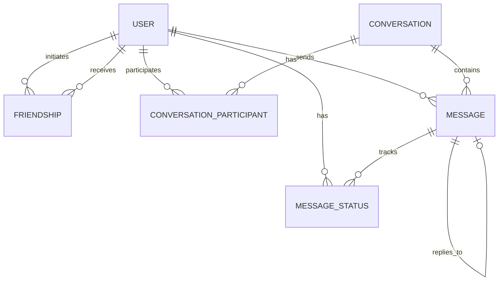

# 🗄️ Database Architecture & Entity Mapping

Tài liệu này mô tả chi tiết cấu trúc cơ sở dữ liệu và cách ánh xạ Entity trong hệ thống **Spring Chat**. Hệ thống sử dụng **PostgreSQL** làm cơ sở dữ liệu chính với các ràng buộc chặt chẽ để đảm bảo tính toàn vẹn dữ liệu.

---

## 📊 Sơ đồ thực thể (ERD)

---

## 📋 Chi tiết các Entity

### 1. User (Người dùng)
Thực thể trung tâm quản lý tài khoản và trạng thái hiện diện.
- `id`: Primary Key (BigInt).
- `username` / `email`: Unique, indexed để tìm kiếm nhanh.
- `password_hash`: Lưu trữ mật khẩu đã mã hóa (BCrypt).
- `status`: Enum (`ACTIVE`, `INACTIVE`, `BANNED`).
- `last_seen`: Timestamp quản lý trạng thái online/offline.

### 2. Friendship (Quan hệ bạn bè)
Quản lý kết nối giữa các người dùng với các ràng buộc logic.
- **Ràng buộc**: `requester_id` != `addressee_id` (không thể tự kết bạn).
- **Duy nhất**: Mỗi cặp người dùng chỉ có một bản ghi duy nhất.
- **Trạng thái**: `PENDING`, `ACCEPTED`, `REJECTED`, `BLOCKED`.

### 3. Conversation (Hội thoại)
- **Loại hình**: `PRIVATE` (chat 1-1) hoặc `GROUP` (chat nhóm).
- Hệ thống được thiết kế để dễ dàng mở rộng thêm các metadata cho nhóm (ảnh đại diện nhóm, tên nhóm).

### 4. Conversation Participant (Thành viên hội thoại)
Bảng trung gian kết nối User và Conversation.
- `last_read_message_id`: Dùng để xác định số lượng tin nhắn chưa đọc (unread count).
- `left_at`: Hỗ trợ tính năng rời nhóm nhưng vẫn giữ lại lịch sử tin nhắn trước đó.

### 5. Message (Tin nhắn)
Lưu trữ nội dung trao đổi.
- `type`: Đa dạng định dạng (`TEXT`, `IMAGE`, `FILE`, `VOICE`, `SYSTEM`).
- `reply_to_id`: Tự tham chiếu (Self-reference) để tạo tính năng trả lời theo luồng.
- **Xóa mềm**: Sử dụng `is_deleted` để bảo toàn dữ liệu nhưng không hiển thị cho người dùng.

### 6. Message Status (Trạng thái tin nhắn)
Theo dõi hành trình của tin nhắn tới từng người nhận.
- Trạng thái: `SENT` -> `DELIVERED` -> `SEEN`.
- Được cập nhật thời gian thực khi người dùng nhận được socket hoặc mở cửa sổ chat.

---

## 🛠️ Implementation Notes (Ghi chú triển khai)

- **Timezone**: Luôn sử dụng `UTC` cho toàn bộ hệ thống (`TIMESTAMP WITH TIME ZONE`).
- **ORM**: Sử dụng Hibernate/JPA với các tối ưu hóa:
  - `@CreationTimestamp` & `@UpdateTimestamp`.
  - `EnumType.STRING` để dữ liệu DB dễ đọc và bảo trì.
- **Performance**: 
  - Đã đánh Index cho các trường thường xuyên truy vấn (`username`, `email`, `created_at`).
  - Sử dụng **PostgreSQL Trigram Extension** cho tính năng tìm kiếm người dùng/tin nhắn không dấu hoặc tìm kiếm gần đúng.

---
*Tài liệu này được cập nhật tự động theo phiên bản Schema mới nhất.*
